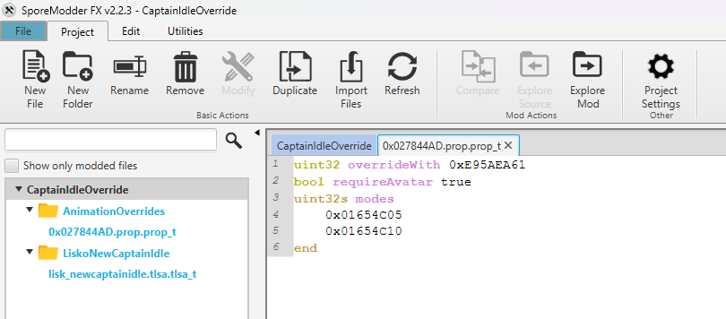

# Animation Overrider
 **Animation Overrider** is a Spore: Galactic Adventures mod to make overriding creature animations easier for non-ModAPI developers. Normally, without a mod like this, you are limited to replacing the entire animation file when overriding animations like this, and are unable to do things like replacing a singular animation with multiple, or any of the fancier stuff you would be able to do with a custom .tlsa file for the animation.

## Developer Guide
First things first, any mod that utilizes Animation Overrider **will require Spore ModAPI** through any of its launcher programs (Spore ModAPI Launcher Kit, Spore Mod Manager etc.), and the Animation Overrider mod itself. Make sure you make these things clear to players when sharing the download link for your mod.

To make use of the Animation Overrider, **you will need to know your overridden animation's ID**, which can generally be found from the TLSA file associated with it, **and think of a new ID** that your animation will use instead. It cannot be the same as the animation being overwritten, but it can otherwise be anything you want barring conflicts with other animation override mods. If you want to make things simpler for yourself, you can use the new animation's FNV hash as the new ID, which can be gotten with SporeModder FX's features.

Once you have thought of the new ID, create two files: A .prop.prop_t file with the name of the overridden animation ID in your SporeModder FX project's "AnimationOverrides" folder (create it if you need to), and .tlsa.tlsa_t file that will contain your new animation's data.



A single .tlsa file can contain multiple animation IDs so you don't need to create multiple of them, but you can since Spore will read all of them in either case. The .tlsa file can also be contained anywhere in the project but for simplicity's sake you can place it in the same folder as your .prop file.

You can look at existing .tlsa files as an example for those, but for the .prop file you will want to have at least the following properties:
```
uint32 overrideWith [your_new_ID_here] 
# The new animation ID that will be loaded instead. It can either be an existing vanilla animation or one added with a mod.

bool requireAvatar [true/false]        
# If true, the override will only activate on the player avatar. Default value is false.

uint32s modes                          
	hash(mode1)
	hash(mode2)
end
# GameMode IDs this override should only activate in. If no modes are set in the prop file, the animation will be overridden globally.

int32 forceChoice -1
# Force a specific animation choice index within the new animation ID. This is optional, as the default value will otherwise be -1.
```
You can look up game mode IDs from the Spore ModAPI SDK documentation (https://emd4600.github.io/Spore-ModAPI/_common_i_ds_8h.html), or as a quick cheat sheet here:
```c++
enum GameModeIDs
{
	/// Not a game mode by itself, used to index game modes.
	kGameModeBase = 0x1654C00,

	/// Cell Stage
	kGameCell = 0x1654C00,

	/// Creature Stage
	kGameCreature = 0x1654C01,

	/// Tribal Stage
	kGameTribe = 0x1654C02,

	/// Civilisation Stage
	kGameCiv = 0x1654C04,

	/// Space Stage
	kGameSpace = 0x1654C05,

	/// ???
	kGameEditMode = 0x1654C06,

	/// Loading screens
	kLoadGameMode = 0x1654C08,

	/// Adventures
	kScenarioMode = 0x1654C10,
	
	/// Editors
	kEditorMode = 0x00DBDBA1,

	/// Main Menu
	kGGEMode = 0x2CCD1D2,

	/// Cinematics
	kGameCinematicsMode = 0x8916F92D
};
```
Once everything is set up correctly, pack your mod to see your animation override in action!

## Credits
* **Liskomato/Tenderi4** - Main developer of Animation Overrider and the animation override mods that preceded it: Neutral Win Animations and New Captain Idle Animations.
* **VanillaCold/ChocIce75** - Creator of the Effect Overrider mod that inspired this mod, and assistance with development.
* **Emd4600** - Creator of SporeModder FX and Spore ModAPI